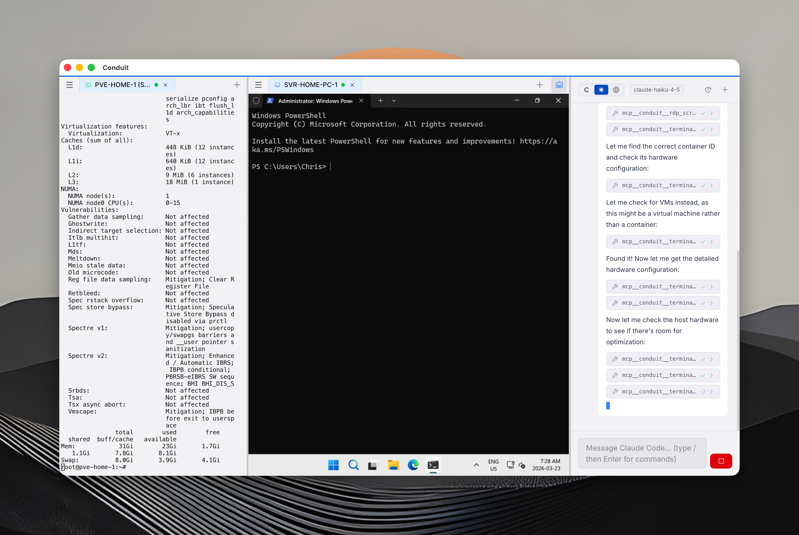
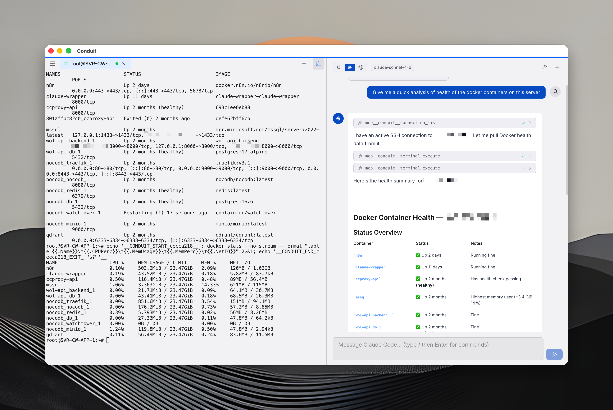
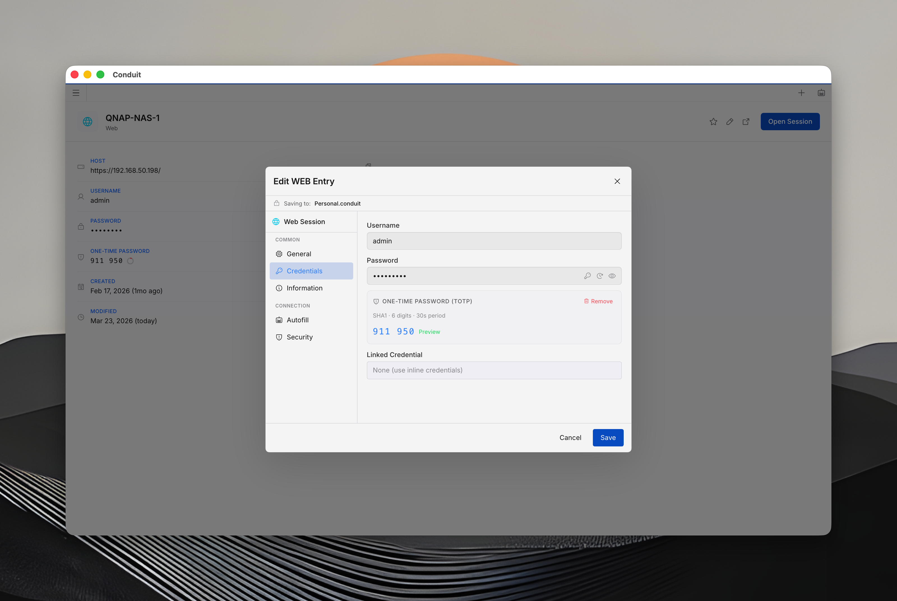
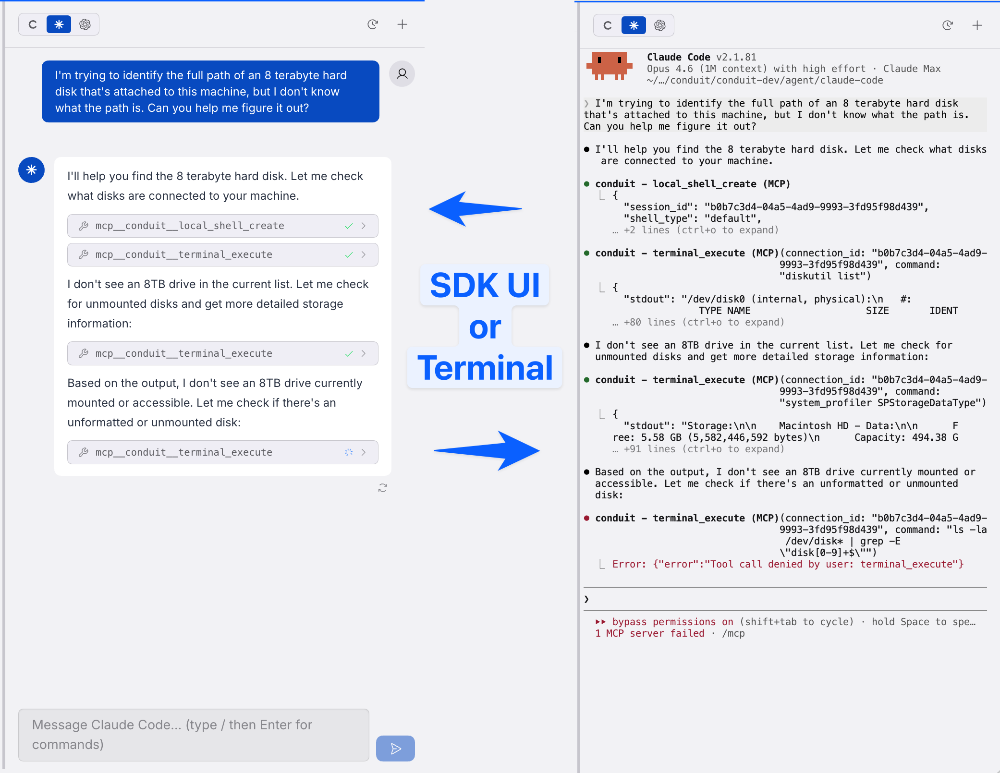
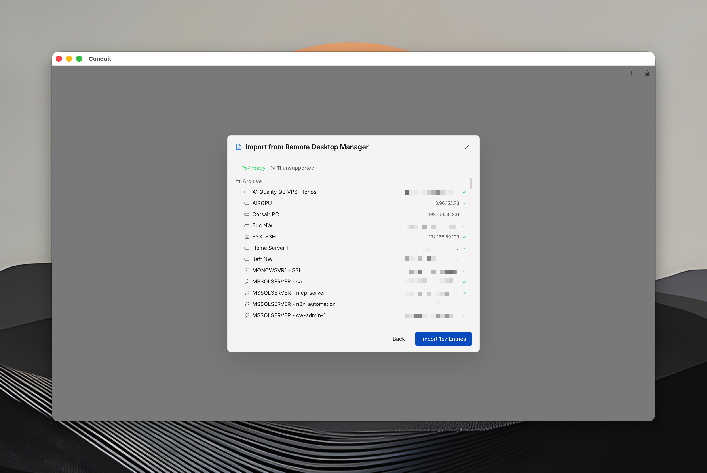

#  Conduit — AI-Powered Remote Connection Manager with MCP Server

[](https://github.com/advenimus/conduit-desktop/releases/latest) [](#installation) [](#mcp-server--ai-agent-integration)

> The first remote desktop manager with a built-in **Model Context Protocol (MCP) server** — giving AI agents like Claude Code and Codex direct access to your SSH, RDP, VNC, and web sessions.



---

## What is Conduit?

Conduit is a **cross-platform remote connection manager** for macOS, Windows, and Linux that combines SSH, RDP, VNC, and web session management with an **encrypted credential vault** and **AI-powered automation**.

Unlike traditional tools like Devolutions Remote Desktop Manager, Royal TS, or mRemoteNG, Conduit is built from the ground up for the AI era. Its **MCP server** lets AI agents execute commands, interact with remote desktops, manage credentials, and automate workflows — all through your existing connections.

### Who is Conduit for?

- **DevOps & SREs** managing fleets of servers via SSH
- **System administrators** connecting to Windows servers via RDP
- **IT professionals** who need a unified tool for SSH, RDP, VNC, and web portals
- **AI-first engineers** using Claude Code, Codex, or other MCP-compatible agents
- **Teams** that need shared, encrypted credential vaults with audit trails

---

## Key Features

### Remote Connection Management

Manage all your remote connections from a single, tabbed interface with **split-view panes** for side-by-side sessions.


| Protocol | Highlights |
|----------|------------|
| **SSH** | xterm.js terminal, key + password auth, multi-session tabs |
| **RDP** | FreeRDP 3.x engine, dynamic resize, clipboard sync, file transfer, High DPI/Retina |
| **VNC** | Full mouse/keyboard interaction, clipboard sync, screenshot capture |
| **Web** | Native Chromium webview, multi-tab browsing, autofill, DOM-aware interaction |
| **Commands** | Run local scripts/commands as managed entries with timeout and shell selection |

- **Bidirectional clipboard** for RDP and VNC sessions
- **File transfer** for RDP — drag-and-drop between local and remote with progress bars
- **Shared folder redirection** with per-drive read-only enforcement
- **Dynamic display resizing** via RDPEDISP channel (RDP adapts to your window size)
- **Edge/WebView2 support** on Windows for native SSO with M365, ServiceNow, SharePoint
- **Multi-tab web browsing** — up to 12 tabs per web session with address bar and navigation


---

### MCP Server & AI Agent Integration

Conduit's **Model Context Protocol (MCP) server** exposes 60+ tools that give AI agents direct, controlled access to your remote sessions. This is what makes Conduit unique.



#### Supported AI Agents

| Agent | Integration |
|-------|-------------|
| **Claude Code** | Full MCP tool access via Unix socket |
| **Codex CLI** | Full MCP tool access via JSON-RPC |
| **Built-in Chat** | Anthropic & OpenAI models with streaming responses |

#### MCP Tool Categories

```
Terminal     — execute commands, read output, send keystrokes, create local shells
RDP          — screenshot, click, type, drag, scroll, resize remote desktops
VNC          — screenshot, click, type, drag, scroll remote sessions
Web          — screenshot, navigate, click elements by CSS selector, fill forms, execute JS
Web Tabs     — list, create, close, switch tabs in web sessions
Credentials  — list, create, read (with approval), delete stored credentials
Connections  — list, open, close SSH/RDP/VNC/web sessions
Documents    — read, create, update markdown documents in the vault
Entries      — get metadata, update notes on any vault entry
```

#### How It Works

1. **Connect** to your servers via SSH, RDP, VNC, or web
2. **Ask your AI agent** to perform tasks on those connections
3. **Approve tool calls** via the universal approval gate (or auto-allow trusted tools)
4. **Watch the AI work** — execute commands, interact with GUIs, read screens, manage files


#### Safety & Controls

Every MCP tool call requires **explicit user approval** before execution:

- Per-tool "Always Allow" for trusted operations
- Category-based color-coded badges (read, execute, write, credential)
- Sensitive argument masking (passwords shown as `********`)
- 120-second auto-deny timeout for unattended prompts
- Rate limiting and full audit logging


---

### Encrypted Credential Vault

All credentials are stored in a **local, AES-256 encrypted vault** — not in the cloud, not in plaintext config files.



- **AES-256 encryption** with master password key derivation
- **SSH key storage** with fingerprint display and key generation (Ed25519, RSA, ECDSA)
- **TOTP/MFA support** — store and auto-generate one-time passwords with countdown timer
- **Password generator** with configurable length and character sets
- **Auto-lock** after configurable inactivity timeout
- **Auto-type credentials** — right-click to type username/password into active sessions
- **Global credential picker** — `Cmd+Shift+Space` to access credentials from anywhere, even when minimized to tray
- **Vault export/import** with passphrase-encrypted `.conduit-export` files

---

### Team Vaults & Zero-Knowledge Sharing

Share credentials securely across your team with **zero-knowledge encryption** — the server never sees your secrets.


- **Zero-knowledge architecture** — X25519 key exchange, per-vault encryption keys
- **Real-time sync** across all team members' devices via Supabase Realtime
- **Folder-level permissions** — admin/editor/viewer roles per folder
- **Full audit trail** — every action logged with 2-year retention
- **VEK rotation** — vault encryption key re-encrypted when members are removed
- **Offline queue** — changes sync automatically when reconnected
- **Recovery passphrase** — 6-word BIP39-style backup for cross-device key recovery

---

### Platform Themes

Conduit adapts to your OS with **four platform-native themes**, each with dedicated icon sets and color schemes.


| Theme | Style |
|-------|-------|
| **Default** | Conduit Classic |
| **macOS Tahoe** | Liquid glass translucency, SF Pro font, backdrop blur |
| **Windows 11** | Fluent Design, Mica surfaces, Segoe UI, WinUI 3 controls |
| **Ubuntu** | GNOME/Libadwaita, bold headerbar, Ubuntu font |

Each theme includes **dark and light modes** plus multiple color schemes (Ocean, Ember, Forest, Amethyst, Rose, Midnight, and OS-native options).

---

### Built-in AI Chat

Chat with AI models directly inside Conduit — with full access to your connections and vault.



- **Three AI engines**: Built-in (Anthropic/OpenAI), Claude Code, and Codex
- **Streaming responses** with stop/cancel
- **Context auto-compaction** for endless conversations
- **Slash commands** — `/model`, `/clear`, `/cost`, `/help`
- **Encrypted chat history** synced to cloud
- **Edit and retry** any message in the conversation

---

### Import from Other Tools

Already using another remote desktop manager? Import your connections and credentials directly.

- **Devolutions Remote Desktop Manager** (.rdm) — SSH, RDP, VNC, web, credentials, folders, secure notes, and documents
  - Automatic credential decryption (no passphrase needed)
  - Duplicate detection with overwrite/skip strategy
  - Folder structure preservation
- **Conduit vault export** (.conduit-export) — encrypted transfer between vaults



---

## Installation

Download the latest release from [GitHub Releases](https://github.com/advenimus/conduit-desktop/releases/latest) or from [conduitdesktop.com/download](https://conduitdesktop.com/download).

### macOS

Download the `.dmg` installer. Supports **Apple Silicon** (M1/M2/M3/M4) and **Intel** Macs.

### Windows

Download the `.exe` installer. Supports **Windows 10** and **Windows 11** (x64 and ARM64).

### Linux

Download the `.AppImage` or `.deb` package. Supports **x64** and **ARM64** distributions.

---

## Comparison

### Conduit vs Remote Desktop Manager (Devolutions)

| Feature | Conduit | Devolutions RDM |
|---------|---------|-----------------|
| MCP Server for AI agents | Yes | No |
| Built-in AI chat | Yes | No |
| Claude Code / Codex integration | Yes | No |
| macOS native app | Yes | Limited (Mac beta) |
| Zero-knowledge team vaults | Yes | Requires DVLS server |
| TOTP credential storage | Yes | Yes |
| SSH, RDP, VNC, Web | Yes | Yes |
| Import from RDM | Yes | N/A |
| Platform themes | 4 themes | 1 theme |
| Pricing | Free tier available | Paid only (for teams) |

### Conduit vs Royal TS / mRemoteNG / Termius

Conduit is the only remote connection manager with a **built-in MCP server** for AI agent integration. If you use Claude Code, Codex, or any MCP-compatible AI tool, Conduit is the bridge between your AI and your infrastructure.

---

## Documentation

Full documentation is available at [conduitdesktop.com/docs](https://conduitdesktop.com/docs):

- [Getting Started](https://conduitdesktop.com/docs/getting-started)
- [SSH Connections](https://conduitdesktop.com/docs/connections/ssh)
- [RDP Connections](https://conduitdesktop.com/docs/connections/rdp)
- [VNC Connections](https://conduitdesktop.com/docs/connections/vnc)
- [Web Sessions](https://conduitdesktop.com/docs/connections/web)
- [MCP Server Setup](https://conduitdesktop.com/docs/mcp/setup)
- [MCP Tools Reference](https://conduitdesktop.com/docs/mcp/tools)
- [Vault & Credentials](https://conduitdesktop.com/docs/vault/security)
- [Team Vaults](https://conduitdesktop.com/docs/vault/team-vaults)
- [AI Chat](https://conduitdesktop.com/docs/ai/built-in)
- [Import Guide](https://conduitdesktop.com/docs/import)

---

## Support

- **Bug reports**: [GitHub Issues](https://github.com/advenimus/conduit-desktop/issues) or in-app via Help > Submit a Bug
- **Feature requests**: [GitHub Issues](https://github.com/advenimus/conduit-desktop/issues) or in-app via Help > Submit Feedback
- **Website**: [conduitdesktop.com](https://conduitdesktop.com)

---

## Keywords

`remote-desktop-manager` `ssh-client` `rdp-client` `vnc-client` `mcp-server` `model-context-protocol` `claude-code` `codex` `ai-agent-tools` `credential-vault` `password-manager` `connection-manager` `devops-tools` `sysadmin` `remote-access` `electron` `cross-platform` `team-vault` `zero-knowledge-encryption` `freerdp`

---

<p align="center">
  <a href="https://conduitdesktop.com">conduitdesktop.com</a>
</p>
